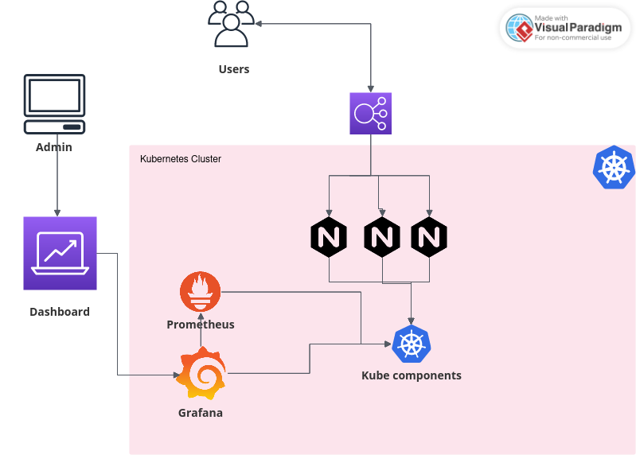

# Swoom-challenge

# Using terraform (HCL), provision a Kubernetes cluster (AWS EKS)

* Pre-requisites: 

  Make sure you have the following installed on your local machine.
    1. Terraform
    2. Git
    3. Kubectl

* Provisioning the cluster

  Clone this repository to your machine
    * git clone https://github.com/rowlandr71/Swoom-challenge.git
    * cd Swoom-challenge
    * terraform init
    * terraform plan
    * terraform apply.

# Deploying a simple Nginx web server on the EKS Cluster using Kubernetes Manifest

* Pre-requistites

  Make sure you have the following provisioned and running.
  1. Docker Engine
  2. Kubernetes Cluster

* Deploying the application.

  Dockerfile for the container can be found in kubernetes/Dockerfile
    * cd kubernetes/
    * docker build -t swoom-app .
    " ensure that your have logged in to a docker registry of your choice"
    * docker tag swoom-app example/swoom-app
    * docker push example/swoom-app
    " update the swoom-app.yaml deployment manifest file with your image"
    * kubectl apply -f swoom-apply.yaml
    * kubectl apply -f swoom-apply-service.yaml

There exists a LivenessProbe and ReadinessProbe that returns a code 200 indicating the pod is running, hence triggers a restart. See kubernetes/swoom-app.yaml.

Web URL to the Web Server
Web Server URL: http://af150be088aea404aab2545db4f9bd55-1480971674.us-east-1.elb.amazonaws.com/

# Monitoring Dashboard using Prometheus and Grafana

To install Prometheus Helm Chart on Kubernetes Cluster, run this helm install command:
* helm install prometheus prometheus-community/prometheus
* kubectl expose service prometheus-server --type=LoadBalancer --target-port=9090 --name=prometheus-server-ext

To install Grafana Helm Chart on Kubernetes Cluster, run this helm install command:
* helm install grafana grafana/grafana
* kubectl expose service grafana --type=LoadBalancer --target-port=3000 --name=grafana-ext

Monitoring Dashboard URL: http://af4218da127dd4a89a88769f6add1d22-1284007714.us-east-1.elb.amazonaws.com/d/ec5487c1-8405-431c-b628-334ac0ac7964/new-dashboard?orgId=1&from=1699539027410&to=1699560627410

Prometheuus Endpoint: http://a31bb457ab2374fdc9ffeba1404dafde-551271074.us-east-1.elb.amazonaws.com/

# Technological Stack

* Terraform: https://developer.hashicorp.com/terraform/intro/use-cases
* Helm: https://helm.sh/docs/intro/using_helm/
* Kubernetes: https://kubernetes.io/docs/concepts/overview/
* Prometheus: https://prometheus.io/
* Grafana: https://grafana.com/grafana/
